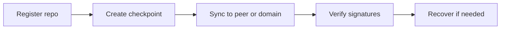

# How It Works

Conceptual guide to gitp2p — the bridge between usage and architecture.

## System Goals

- **Local-first sovereignty** — Your vaults, checkpoints, and identity live on your machine.
- **Verifiable sync** — Checkpoints and sessions are cryptographically signed.
- **Trusted collaboration** — Only approved peers can push or replicate.
- **Offline resilience** — Bundles and portable vaults work without network.
- **Decentralized federation (v5)** — Cross-domain sync without mandatory central registries.

## Core Concepts

See [architecture/GLOSSARY.md](architecture/GLOSSARY.md) for full definitions.

| Concept | One-line meaning |
|---------|------------------|
| **Identity / Peer** | Your Ed25519 key pair and network presence |
| **Vault** | Container for repos, policies, and checkpoints |
| **Repository** | Registered Git project under a vault |
| **Checkpoint** | Signed immutable recovery point |
| **Lineage** | Ordered checkpoint history |
| **Trust zone** | Per-repo policy label (trusted, readonly, quarantined, …) |
| **Federation domain** | Sovereign boundary with own trust/routing/peering policies |
| **Gateway** | Domain exit/entry for cross-domain route exchange |
| **Peering** | Signed link between two domains |
| **Delegation** | Extending trust across domain/gateway boundaries |

## Mental Model

Think of gitp2p as four layers stacked:

```text
1. Git working tree     ← where you commit
2. Vault + checkpoint   ← signed recovery snapshots
3. Trusted peer graph   ← who you sync with
4. Federation domains   ← optional global boundaries (v5)
```

You always own layer 1–2. Layer 3 is explicit trust. Layer 4 is optional and decentralized.

## High-Level Workflow



1. **Register** a Git repo into a vault with a trust zone.
2. **Checkpoint** captures current commit as signed recovery point.
3. **Sync** pushes mirror state to trusted peer or traverses federation path.
4. **Verify** confirms signatures, lineage, and manifests.
5. **Recover** restores from local, peer, bundle, or cross-domain replica.

## Major Components

| Component | Role |
|-----------|------|
| CLI | User commands |
| Vault | Repo/checkpoint lifecycle |
| Trust | Identity, zones, delegation |
| Sync | Peer discovery and replication |
| Mesh / Routing | Multi-hop and global paths |
| Federation stack | Domains, gateways, peering, discovery |
| Verify | Unified cryptographic validation |
| Bundle / CAS | Offline and content-addressed storage |

Details: [architecture/SYSTEM_COMPONENTS.md](architecture/SYSTEM_COMPONENTS.md).

## Design Principles

- **No mandatory cloud** — Works without GitHub or any hosted service.
- **Explicit trust** — Discovery ≠ trust; approval required.
- **Signed everything important** — Checkpoints, sessions, federation records.
- **Filesystem portable** — Multi-node tests use separate home directories.
- **Incremental releases** — v1 local → v5 global; each layer optional.

## Limitations

- **CLI only** — No built-in web UI or mobile app.
- **Filesystem default** — QUIC/mDNS require network configuration.
- **v5 gateway wire protocol** — Cross-domain exchange is KV-file simulated; production WAN gateway protocol is future work.
- **Single-writer homes** — Avoid concurrent processes on same `GITP2P_HOME`.
- **Coarse trust zones** — Repo-level policy, not per-branch ACLs.

---

**Related documents:** [GETTING_STARTED.md](GETTING_STARTED.md) · [architecture/OVERVIEW.md](architecture/OVERVIEW.md) · [architecture/GLOSSARY.md](architecture/GLOSSARY.md) · [FAQs.md](FAQs.md)
