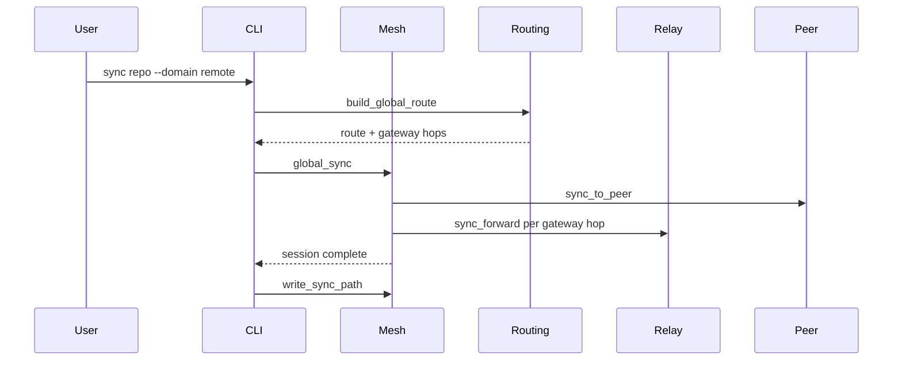

# Data Flow

How data moves through gitp2p from registration to cross-domain sync.

## Data Sources

| Source | Data |
|--------|------|
| User Git repo | Working tree commits |
| Peer mirror | Remote vault replica |
| Bundle/vault package | Offline export |
| Gateway exchange cache | Routes, discovery entries |
| Discovery cache | Aggregated domains/gateways/vaults/replicas |

## Processing Pipeline

### 1. Repository registration

```text
User path → gitp2p repo add → vault metadata + trust zone
```

The working tree stays in place; gitp2p registers path and vault association.

### 2. Checkpoint creation

```text
git fetch/clone mirror → git commit HEAD → sign checkpoint → vault metadata
```

Checkpoints capture commit hash, parent chain, lineage, and Ed25519 signature.

### 3. Local peer sync

```text
discover peer → trust approve → sync_to_peer → replication record
```

Mirror updated under `vaults/<id>/repositories/<repo-id>/`.

### 4. Global sync (v5)



Steps:

1. **Discovery** — `discover domains/gateways/replicas` or peering fixture.
2. **Route selection** — `build_global_route` + delegation validation.
3. **Gateway traversal** — Relay forward audit for each hop.
4. **Sync** — Actual data transfer to trusted peer.
5. **Verification** — `verify checkpoint`, `sync inspect`, optional `verify route`.

## Transformations

| Stage | Input | Output |
|-------|-------|--------|
| Checkpoint | Git HEAD | Signed checkpoint KV + lineage update |
| CAS store | File bytes | Content-addressed chunk |
| Bundle export | Vault mirror | Portable bundle + manifest |
| Delta | Local/remote chunks | Missing chunk list |
| Merkle verify | Lineage leaves | Root hash confirmation |
| Delegation | Source/target IDs | Signed delegation chain |

## Persistence

All pipeline artifacts land under `GITP2P_HOME`:

- Checkpoints → `vaults/.../metadata/checkpoints/`
- Sessions → `sessions/`
- Global routes → `routing/global/`
- Sync paths → `sync/paths/`
- Replication → `vaults/.../replication/`

## Outputs

- Updated Git mirror in vault
- Recovery target path (`recover --target`)
- Topology/routing inspection (`topology summary`, `route inspect --global`)
- Verification reports (`verify domain|gateway|route|...`)

## Failure Scenarios

| Failure | Behavior |
|---------|----------|
| Untrusted peer | Sync denied by trust zone |
| Unknown peer | Error: run `peers discover` first |
| Relay disabled during global sync | Enable with `relay enable` |
| No recovery source | `recover global` / `recover sources` returns empty |
| Revoked delegation | Route verification fails |
| Gateway unavailable | `failover_route` selects alternate path |
| Corrupt mirror | `repo doctor` reports unhealthy state |

---

**Related documents:** [NETWORKING.md](NETWORKING.md) · [FAILURE_RECOVERY.md](FAILURE_RECOVERY.md) · [EXECUTION_MODEL.md](EXECUTION_MODEL.md)
