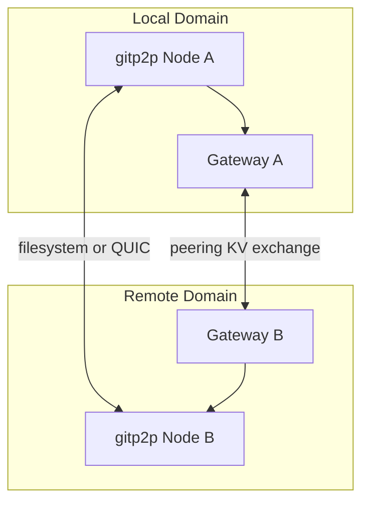

# Networking Architecture

Communication paths between gitp2p nodes and federation domains.

## Network Topology

Three connectivity layers:

1. **Intra-domain peer sync** — Direct between peers in the same trust graph.
2. **LAN discovery** — mDNS broadcast on local network.
3. **Cross-domain** — Gateway-mediated route and discovery exchange (v5).

## Protocols

| Transport | Use case | Configuration |
|-----------|----------|---------------|
| **Filesystem** | Shared mounts, NAS, WSL paths, airgap | `GITP2P_PEER_HOMES`, `peers discover` |
| **mDNS** | LAN peer discovery | `peers discover --lan`, service `_gitp2p._tcp.local.` |
| **QUIC + TLS** | Encrypted peer sync | `GITP2P_TRANSPORT=quic`, `peers listen` |
| **Gateway KV exchange** | Cross-domain metadata (v5) | Files under `federation/gateways/<id>/exchange/` |

Default transport is filesystem/auto. QUIC requires TLS material under `~/.gitp2p/tls/`.

## Connection Lifecycle

### Peer discovery

1. Scan `GITP2P_PEER_HOMES` or LAN mDNS.
2. Validate peer identity (public key → peer ID).
3. Write peer record to `~/.gitp2p/peers/`.
4. Operator approves trust: `gitp2p trust approve <peer-id>`.

### Sync session

1. Route selection (`discover_routes` / `build_global_route`).
2. Session created with negotiate → transfer → complete phases.
3. Replication state written under vault `replication/`.
4. Optional relay forward for mesh/global hops.

### Gateway peering (v5)

1. Create domains and gateways on each side.
2. `peer-domain connect` writes signed peering manifest.
3. `exchange_routes` / `exchange_discovery` populate gateway exchange dirs.
4. Global discovery aggregates from local + exchanged caches.

## Synchronization Mechanisms

- **Direct peer sync** — `gitp2p sync --peer <id>` copies mirror state.
- **Mesh sync** — Multi-hop via `gitp2p-mesh` and routing table.
- **Global sync** — `gitp2p sync --domain <remote-domain>` builds global route, syncs to trusted peer, records gateway forward audit via relay.
- **Bundle/offline** — No network; portable files.

Concurrent syncs limited by `GITP2P_MAX_CONCURRENT_SYNCS` (default 2).

## Reliability Guarantees

- **Trusted peer required** — Sync to untrusted peers denied by trust zones.
- **Signed checkpoints** — Recovery validates signature before restore.
- **Relay audit trail** — Forward events cached when relay enabled.
- **Failover routes** — `failover_route` selects alternate gateway path (v5).
- **No guaranteed delivery** — Best-effort sync; operator must verify with `checkpoint verify` and `sync inspect`.

---

**Related documents:** [DATA_FLOW.md](DATA_FLOW.md) · [SECURITY_ARCHITECTURE.md](SECURITY_ARCHITECTURE.md) · [SCALING.md](SCALING.md)
