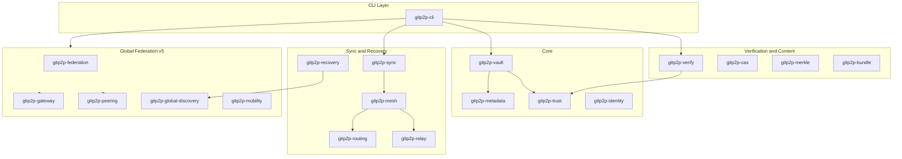
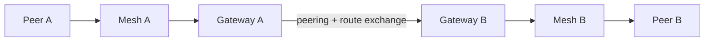

# Architecture Overview

Architecture entry point for gitp2p v5.0.0.

## System Overview

gitp2p is a local-first CLI that wraps Git repositories in **vaults**, creates **signed checkpoints** for recovery, synchronizes with **trusted peers**, and (in v5) connects **federation domains** through **gateways** without requiring centralized infrastructure.

The workspace ships as 27 Rust crates orchestrated by `gitp2p-cli`. All runtime state lives under `GITP2P_HOME` (default `~/.gitp2p/`).

### Version evolution

| Version | Focus | Question answered |
|---------|-------|-------------------|
| v1 | Sovereign vaults, checkpoints, local recovery | Can I recover my repo without GitHub? |
| v2 | Trusted peers, LAN/filesystem sync | Can I sync with people I trust on my network? |
| v3 | Bundles, portable vaults, lineage | Can I move repos offline and verify history? |
| v4 | Mesh routing, relay, topology | Can sync traverse multiple hops? |
| v4.5 | Identity, CAS, Merkle, unified verify | WHO signed WHAT content? |
| v5 | Domains, gateways, peering, global sync | WHERE does trusted sync cross organizational boundaries? |

## Architectural Goals

- **Local-first sovereignty** — Users own vaults, identity, and checkpoints on their machine.
- **Verifiable trust** — Signatures on checkpoints, sessions, federation records, and delegations.
- **Decentralized federation** — Domains peer via gateways; no mandatory public registry.
- **Filesystem portability** — Peer sync and multi-domain tests work via shared paths or separate `GITP2P_HOME` directories.
- **Incremental complexity** — Each release layer builds on prior crates without breaking local workflows.

## Design Constraints

- CLI-only interface (no bundled web UI).
- Default transport is filesystem peer discovery; QUIC/mDNS are additive.
- v5 gateway route/discovery exchange is KV-file simulated before wire protocol.
- Metadata stored as KV files, not an embedded SQL database.
- MIT licensed, Rust 2021 workspace.

## Major Subsystems

## System Diagram (cross-domain sync)

Flow: **Discovery → Route selection → Gateway traversal → Sync → Verification**

## Document Navigation

| Document | Topic |
|----------|-------|
| [SYSTEM_COMPONENTS.md](SYSTEM_COMPONENTS.md) | 27-crate catalog and dependencies |
| [DATA_FLOW.md](DATA_FLOW.md) | Checkpoint, sync, and global sync pipelines |
| [EXECUTION_MODEL.md](EXECUTION_MODEL.md) | CLI dispatch, concurrency, session lifecycle |
| [STORAGE.md](STORAGE.md) | `~/.gitp2p/` layout and consistency |
| [NETWORKING.md](NETWORKING.md) | Filesystem, mDNS, QUIC, gateway exchange |
| [SECURITY_ARCHITECTURE.md](SECURITY_ARCHITECTURE.md) | Identity, trust zones, signing, verify |
| [DEPLOYMENT_ARCHITECTURE.md](DEPLOYMENT_ARCHITECTURE.md) | Single-node and multi-domain deployment |
| [FAILURE_RECOVERY.md](FAILURE_RECOVERY.md) | Recovery paths and failover |
| [SCALING.md](SCALING.md) | Limits and capacity planning |
| [EXTENSIBILITY.md](EXTENSIBILITY.md) | Adding crates, CLI commands, metadata |
| [DECISIONS.md](DECISIONS.md) | Architectural decision records |
| [GLOSSARY.md](GLOSSARY.md) | Terminology |

User-facing docs: [GETTING_STARTED.md](../GETTING_STARTED.md) · [HOW_IT_WORKS.md](../HOW_IT_WORKS.md) · [SECURITY.md](../SECURITY.md) · [FAQs.md](../FAQs.md)

---

**Related documents:** [README.md](../../README.md) · [HOW_IT_WORKS.md](../HOW_IT_WORKS.md) · [GLOSSARY.md](GLOSSARY.md)
