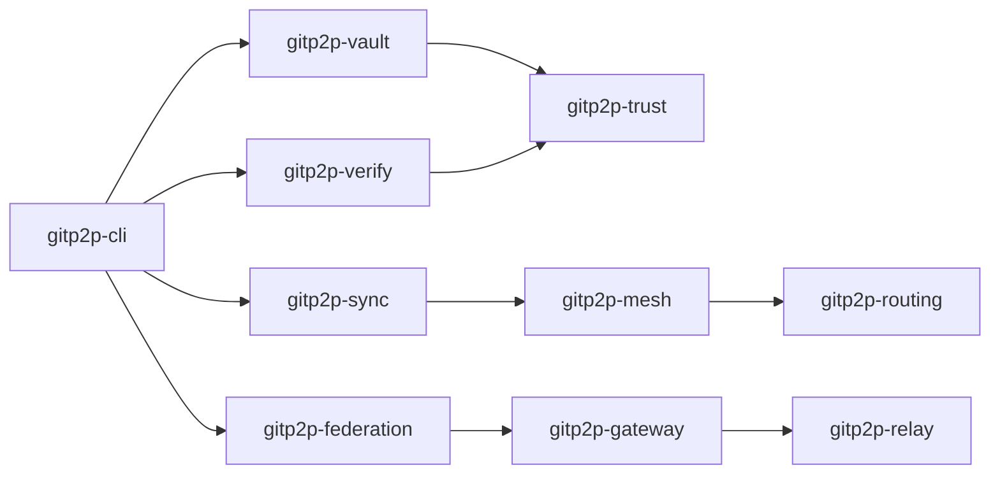

# System Components

Component inventory for the gitp2p v5.0.0 workspace (27 crates).

## Component Catalog

### CLI and metadata foundation

| Crate | Responsibility |
|-------|----------------|
| `gitp2p-cli` | User-facing CLI (`clap`); dispatches to subsystem crates via `main.rs` and `extended.rs` |
| `gitp2p-metadata` | Shared models, KV I/O, Git helpers, error types, utilities |

### Identity and trust

| Crate | Responsibility |
|-------|----------------|
| `gitp2p-trust` | Ed25519 identity, signing, trust zones, policies, trust graph, **delegation chains** |
| `gitp2p-identity` | Formal ID helpers: PeerID, VaultID, CheckpointID, DomainID, GatewayID, etc. |

### Vault and content

| Crate | Responsibility |
|-------|----------------|
| `gitp2p-vault` | Vault/repo/checkpoint lifecycle, retention, `App` home directory API |
| `gitp2p-cas` | Content-addressable chunk storage |
| `gitp2p-dedup` | Chunk deduplication statistics |
| `gitp2p-delta` | Delta chunk propagation |
| `gitp2p-merkle` | Merkle root computation and verification |

### Sync, mesh, and routing

| Crate | Responsibility |
|-------|----------------|
| `gitp2p-sync` | Peer replication, filesystem/LAN discovery, QUIC server, session management |
| `gitp2p-routing` | Local and **global routes**, route verify, failover |
| `gitp2p-relay` | Relay forwarding cache and propagation |
| `gitp2p-mesh` | Multi-hop and **global sync**, sync path inspection |
| `gitp2p-topology` | Topology summaries (peers, trust, routes, vaults) |

### Portable federation (v3)

| Crate | Responsibility |
|-------|----------------|
| `gitp2p-bundle` | Bundle export/import, structured bundles, encryption |
| `gitp2p-lineage` | Checkpoint lineage chains and hashing |
| `gitp2p-manifest` | Federation manifest read/verify |
| `gitp2p-reconciliation` | Delayed merge validation |
| `gitp2p-portable-vault` | Vault package export/import |
| `gitp2p-media` | Removable media export/import helpers |

### Recovery and verification

| Crate | Responsibility |
|-------|----------------|
| `gitp2p-recovery` | Doctor, local/peer/multi/**global** recovery |
| `gitp2p-verify` | Unified verify pipeline for peers, checkpoints, domains, gateways, routes |

### Global federation (v5)

| Crate | Responsibility |
|-------|----------------|
| `gitp2p-federation` | Domain create/inspect/policy/delete, federation layout |
| `gitp2p-gateway` | Gateway lifecycle, route/discovery exchange, sync forwarder |
| `gitp2p-peering` | Domain peering connect/revoke/inspect |
| `gitp2p-global-discovery` | Discover domains, gateways, vaults, replicas |
| `gitp2p-mobility` | Domain migration with ID continuity |

## Responsibilities

- **CLI** parses commands and never embeds business logic beyond dispatch.
- **metadata** owns all serializable structs and the KV format.
- **vault** owns on-disk vault layout and checkpoint creation.
- **sync/mesh** own transport and multi-hop traversal.
- **federation stack** owns cross-domain metadata; v5 uses filesystem KV simulation for gateway exchange.
- **verify** centralizes cryptographic validation entry points.

## Ownership Boundaries

| Concern | Owner crate | Not owned by |
|---------|-------------|--------------|
| Git mirror files | `gitp2p-vault` | `gitp2p-sync` (reads/writes via vault paths) |
| Peer trust state | `gitp2p-trust` | CLI (only invokes) |
| Federation domains | `gitp2p-federation` | `gitp2p-peering` (references domain IDs) |
| Global routes | `gitp2p-routing` | `gitp2p-gateway` (exchange only) |
| Session signatures | `gitp2p-trust` | `gitp2p-sync` (calls signing) |

## Dependencies

Dependency tiers (higher depends on lower):

```text
Tier 0: gitp2p-metadata
Tier 1: gitp2p-trust, gitp2p-identity
Tier 2: gitp2p-vault, gitp2p-cas, gitp2p-manifest, gitp2p-lineage, ...
Tier 3: gitp2p-sync, gitp2p-routing, gitp2p-federation
Tier 4: gitp2p-gateway, gitp2p-peering, gitp2p-mesh, gitp2p-recovery
Tier 5: gitp2p-global-discovery, gitp2p-mobility, gitp2p-verify
Tier 6: gitp2p-cli
```

Avoid circular crate dependencies (e.g. `gitp2p-trust` must not depend on `gitp2p-vault`).

## Interactions



---

**Related documents:** [OVERVIEW.md](OVERVIEW.md) · [DATA_FLOW.md](DATA_FLOW.md) · [EXTENSIBILITY.md](EXTENSIBILITY.md)
